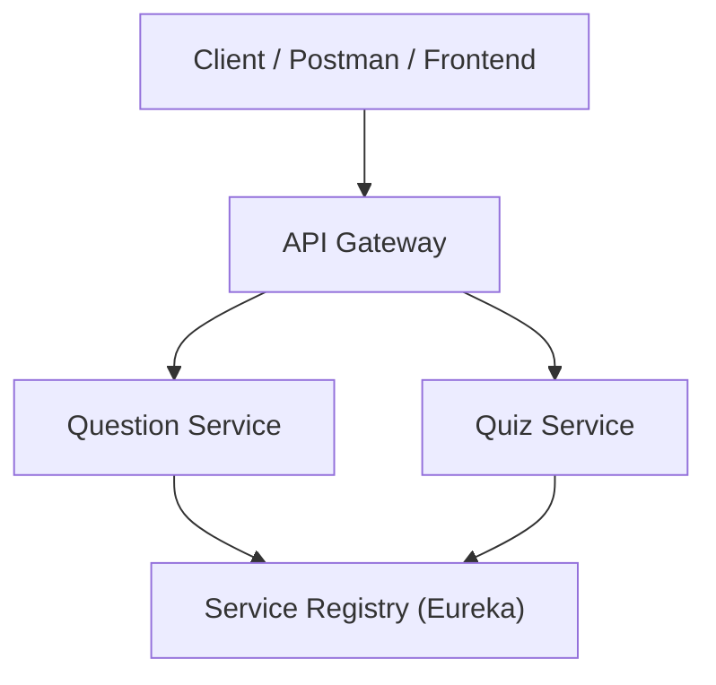

# 📘 Quiz App Using Microservices

[](https://www.oracle.com/java/technologies/javase/jdk17-archive-downloads.html)
[](https://spring.io/projects/spring-boot)
[](#)
[](LICENSE)

A **Quiz Application** built with **Spring Boot Microservices** architecture.  
This project demonstrates service discovery, API gateway, and communication between microservices.

---

## 🏗️ Architecture



---

## 📂 Project Structure

```
Quiz-App-Using-MicroServices/
│
├── api-gateway/            # API Gateway for routing
├── question-service-ms/    # Manages questions
├── quiz-service-ms/        # Manages quiz creation & evaluation
└── service-registry/       # Eureka Server for discovery
```

---

## 🛠️ Setup & Run Locally

### 1️⃣ Clone the Repository
```bash
git clone https://github.com/Vivek1035/Quiz-App-Using-MicroServices.git
cd Quiz-App-Using-MicroServices
```

### 2️⃣ Start the Service Registry
```bash
cd service-registry
mvn spring-boot:run
```
Runs at 👉 [http://localhost:8761](http://localhost:8761)

### 3️⃣ Start the API Gateway
```bash
cd api-gateway
mvn spring-boot:run
```
Runs at 👉 [http://localhost:8080](http://localhost:8080)

### 4️⃣ Start the Microservices
```bash
# Question Service
cd question-service-ms
mvn spring-boot:run

# Quiz Service
cd quiz-service-ms
mvn spring-boot:run
```

---

## 🔗 API Endpoints

### 📌 Question Service
- `POST /question` → Add new question  
- `GET /question/all` → Get all questions  
- `GET /question/{id}` → Get question by ID  

### 📌 Quiz Service
- `POST /quiz/create` → Create a new quiz  
- `POST /quiz/submit` → Submit quiz & evaluate score  

⚠️ **Note:** Access all APIs through the API Gateway 👉 [http://localhost:8080/...](http://localhost:8080/)

---

## 🧪 Testing

Use **Postman** or **cURL** to test APIs. Example:  

```bash
curl -X GET http://localhost:8080/question/all
```

---

## 🔮 Future Enhancements
- 🔐 Add Authentication & Authorization (**JWT/OAuth2**)  
- 💾 Integrate with **MySQL/Postgres** database  
- 🌐 Build a **Frontend (React/Angular)**  
- 🐳 Containerize using **Docker & Kubernetes**  
- ✅ Add **Unit & Integration Tests**  
- 📊 Include **Monitoring (Prometheus/Grafana)**  

---

## 👨‍💻 Author
**Vivek Singh**  
🔗 [GitHub Profile](https://github.com/Vivek1035)

---

## 📜 License  

This project is licensed under the [MIT License](./LICENSE).
